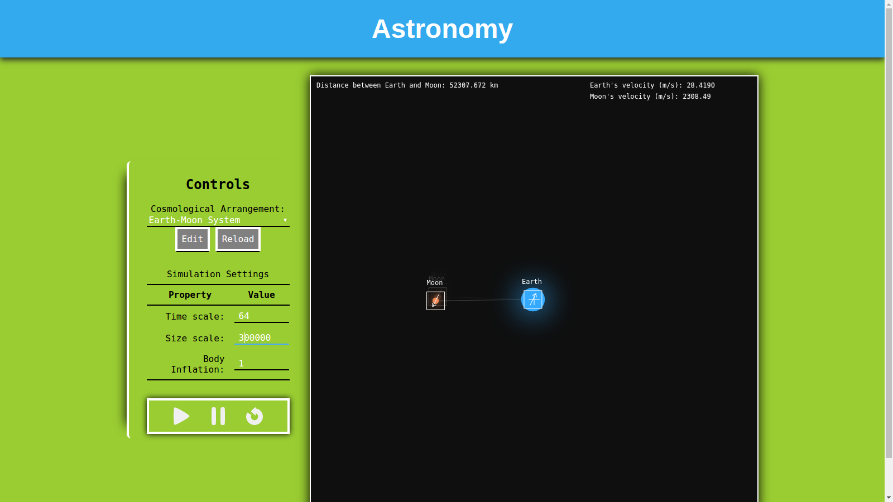

# Gravity Simulator

## What

This is a 2D gravity simulator that is meant to run right in the browser. It
uses the canvas element to animate the movement of entities within the system.
These entities are governed by Newton's law of universal gravitation.

## Why

1. To learn more about git and become comfortable using it.
2. To learn more about javascript and practice programming in it.
3. To have some fun, it's good for your heart.

## How do I play with it?

1. Clone it.
2. Once cloned, open the view.html file in your browser of choice.
3. Play with it.
